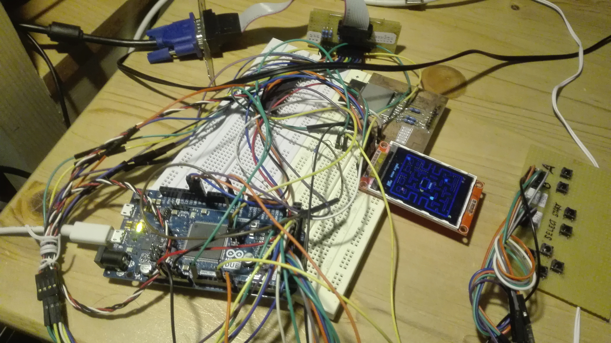
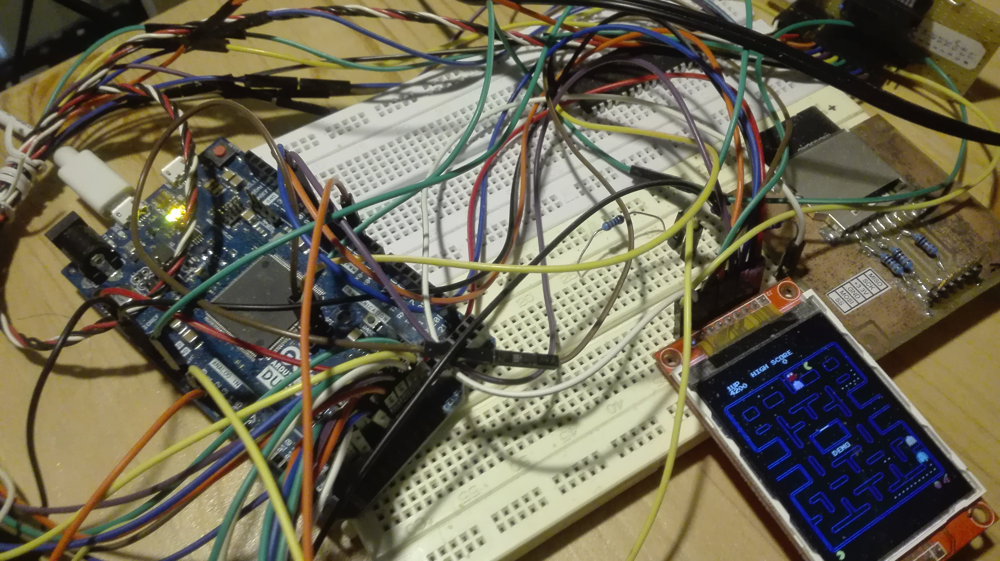
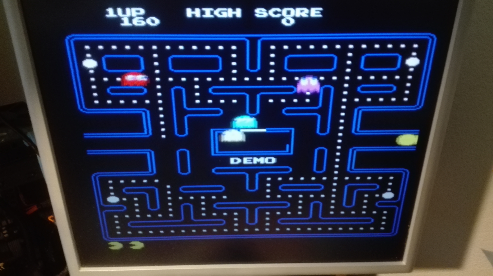

# Pacman-Arduino-Due
Pacman Game for Arduino Due with tft ILI9341 and VGA output support

Pacman Game on Arduino Due with ILI9341 and VGA support (available 2 outputs at the same time), playable with keypad, 5 sample levels, VGA output is 240x320, source code avaliable on Github, Licensed under MIT License.

Arduino Forum:

http://forum.arduino.cc/index.php?topic=375394.0

Video:

https://www.youtube.com/watch?v=2Hdzr6m4QdU

<pre>
/******************************************************************************/
/*                                                                            */
/*  PACMAN GAME FOR ARDUINO DUE                                               */
/*                                                                            */
/******************************************************************************/
/*  Copyright (c) 2014  Dr. NCX (mirracle.mxx@gmail.com)                      */
/*                                                                            */
/* THE SOFTWARE IS PROVIDED "AS IS" AND THE AUTHOR DISCLAIMS ALL              */
/* WARRANTIES WITH REGARD TO THIS SOFTWARE INCLUDING ALL IMPLIED              */
/* WARRANTIES OF MERCHANTABILITY AND FITNESS. IN NO EVENT SHALL THE AUTHOR    */
/* BE LIABLE FOR ANY SPECIAL, DIRECT, INDIRECT, OR CONSEQUENTIAL DAMAGES      */
/* OR ANY DAMAGES WHATSOEVER RESULTING FROM LOSS OF USE, DATA OR PROFITS,     */
/* WHETHER IN AN ACTION OF CONTRACT, NEGLIGENCE OR OTHER TORTIOUS ACTION,     */
/* ARISING OUT OF OR IN CONNECTION WITH THE USE OR PERFORMANCE OF THIS        */
/* SOFTWARE.                                                                  */
/*                                                                            */
/*  MIT license, all text above must be included in any redistribution.       */
/******************************************************************************/
/*  ILI9341:                                                                  */
/*----------------------------------------------------------------------------*/
/*   8 = RST                                                                  */
/*   9 = D/C                                                                  */
/*  10 = CS                                                                   */
/*                                                                            */
/*----------------------------------------------------------------------------*/
/*  VGA:                                                                      */
/*----------------------------------------------------------------------------*/
/*  41 = R --[470R]--     }                                                   */
/*  40 = R --[ 1K ]--     } = VGA 1 (RED)                                     */
/*  39 = R --[ 2K2]--     }                                                   */
/*                                                                            */
/*  38 = G --[470R]--     }                                                   */
/*  37 = G --[ 1K ]--     } = VGA 2 (GREEN)                                   */
/*  36 = G --[ 2K2]--     }                                                   */
/*                                                                            */
/*  35 = B --[390R]--     } = VGA 3 (BLUE)                                    */
/*  34 = B --[820R]--     }                                                   */
/*                                                                            */
/*  43 = Hsync --[ 82R]--  = VGA 13                                           */
/*  42 = Vsync --[ 82R]--  = VGA 14                                           */
/*                                                                            */
/*----------------------------------------------------------------------------*/
/*  KEYPAD:                                                                   */
/*----------------------------------------------------------------------------*/
/*  38 = button START                                                         */
/*  40 = button SELECT                                                        */
/*  44 = button A                                                             */
/*  42 = button B                                                             */
/*  52 = button UP                                                            */
/*  50 = button DOWN                                                          */
/*  48 = button LEFT                                                          */
/*  46 = button RIGHT                                                         */
/*                                                                            */
/******************************************************************************/
</pre>
